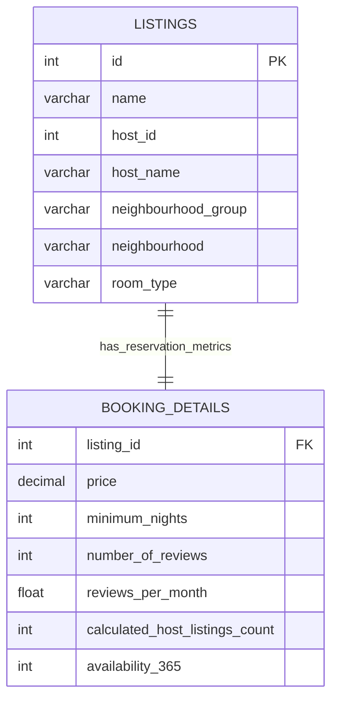

# 🏠 Airbnb NYC Lodging & Booking Market Analysis

[](https://www.mysql.com/)
[](https://en.wikipedia.org/wiki/SQL)
[](https://github.com/jadavharsh109/airbnb-nyc-market-analysis-sql)
[](https://www.linkedin.com/in/harshjadav0901/)
[](LICENSE)

An in-depth **SQL market analysis and pricing strategy engine** evaluating ~49,000 real-world Airbnb listings across New York City’s five boroughs (Manhattan, Brooklyn, Queens, Bronx, Staten Island). Features multi-table relational modeling, SQL self-joins for multi-property host detection, nested subqueries, and 50 structured business queries addressing lodging availability, rental rate ceilings, and review velocity.

---

## 📑 Table of Contents
- [📌 Business Context & Objectives](#-business-context--objectives)
- [📁 Project Structure](#-project-structure)
- [🗄️ Relational Schema Architecture](#️-relational-schema-architecture)
- [📋 Schema Data Dictionary](#-schema-data-dictionary)
- [📊 Key Market Insights & SQL Queries](#-key-market-insights--sql-queries)
  - [1. Borough-Level Revenue & Inventory Concentration](#1-borough-level-revenue--inventory-concentration)
  - [2. Multi-Property Host Identification (Self-Joins)](#2-multi-property-host-identification-self-joins)
  - [3. Room Type Pricing Ceilings & Availability](#3-room-type-pricing-ceilings--availability)
  - [4. High-Demand Listings (500+ Reviews & High Velocity)](#4-high-demand-listings-500-reviews--high-velocity)
  - [5. Commercial Host Portfolio Concentration](#5-commercial-host-portfolio-concentration)
  - [6. Listing Keyword Text Mining ('Cozy' Marketing)](#6-listing-keyword-text-mining-cozy-marketing)
- [🛠️ Advanced SQL Techniques Demonstrated](#️-advanced-sql-techniques-demonstrated)
- [🚀 Quickstart & Setup Guide](#-quickstart--setup-guide)
- [👨‍💻 Author](#-author)

---

## 📌 Business Context & Objectives

The short-term rental market in New York City is highly volatile and heavily stratified by geography, seasonality, and local regulations. Key questions explored:
1. **Supply Disparity:** How does listing inventory and pricing distribute between high-density tourist hubs (Manhattan) and residential boroughs?
2. **Commercial Host Footprint:** How many listings are held by multi-unit commercial operators vs. single-property individual hosts?
3. **Occupancy & Velocity:** Which micro-neighborhoods maintain the highest monthly review frequency and minimum stay mandates?
4. **Keyword Valuation:** Does property title phrasing (e.g. `cozy`, `spacious`) correlate with pricing premiums?

---

## 📁 Project Structure

```
airbnb-nyc-market-analysis-sql/
├── data/
│   ├── listing.csv                      # 48,895 property listings (IDs, hosts, boroughs, room types)
│   └── Booking_details.csv              # 48,895 booking records (prices, minimum nights, reviews, availability)
├── sql/
│   ├── 01_schema_setup.sql              # DDL schema definition, PK/FK, indexes & bulk ingestion
│   ├── 02_exploratory_and_pricing_analytics.sql # 18 foundational queries for price & nights distribution
│   └── 03_advanced_business_analytics.sql # 13 advanced queries (self-joins, subqueries, host portfolios)
├── .gitignore                           # Git hygiene configuration
├── LICENSE                              # MIT License
└── README.md                            # Comprehensive project documentation
```

---

## 🗄️ Relational Schema Architecture



---

## 📋 Schema Data Dictionary

| Table | Attribute | Type | Constraint | Description |
| :--- | :--- | :--- | :--- | :--- |
| **`Listings`** | `id` | `INT` | `PRIMARY KEY` | Unique Airbnb listing identifier |
| | `name` | `VARCHAR(255)` | `NULL` | Public title / property headline |
| | `host_id` | `INT` | `NOT NULL` | Unique host identifier |
| | `host_name` | `VARCHAR(100)` | `NULL` | Host display name |
| | `neighbourhood_group` | `VARCHAR(50)` | `NOT NULL` | Borough (`Manhattan`, `Brooklyn`, etc.) |
| | `neighbourhood` | `VARCHAR(100)` | `NOT NULL` | Specific neighborhood community |
| | `room_type` | `VARCHAR(50)` | `NOT NULL` | Space type (`Entire home/apt`, `Private room`, `Shared room`) |
| **`Booking_Details`** | `listing_id` | `INT` | `FOREIGN KEY` | Mapped to `Listings.id` |
| | `price` | `DECIMAL(10,2)`| `NOT NULL` | Nightly rate in USD |
| | `minimum_nights` | `INT` | `NOT NULL` | Minimum reservation length required |
| | `number_of_reviews` | `INT` | `NOT NULL` | Cumulative review count |
| | `reviews_per_month` | `FLOAT` | `NULL` | Monthly velocity of customer feedback |
| | `calculated_host_listings_count`| `INT` | `NOT NULL`| Total properties owned by this host |
| | `availability_365` | `INT` | `NOT NULL` | Available reservation days per year (0–365) |

---

## 📊 Key Market Insights & SQL Queries

### 1. Borough-Level Revenue & Inventory Concentration
* **Objective:** Quantify aggregate supply, cumulative pricing volume, and average listing rates across boroughs.
* **SQL Implementation:**
```sql
SELECT 
    l.neighbourhood_group, 
    COUNT(l.id) AS total_listings,
    ROUND(SUM(b.price), 2) AS total_price_volume,
    ROUND(AVG(b.price), 2) AS avg_price,
    MAX(b.price) AS max_price
FROM Listings l
JOIN Booking_Details b ON l.id = b.listing_id
GROUP BY l.neighbourhood_group
ORDER BY total_price_volume DESC;
```
* **Key Takeaway:** Manhattan and Brooklyn hold over 85% of total citywide inventory, with Manhattan commanding the highest average nightly rate ($196.88).

---

### 2. Multi-Property Host Identification (Self-Joins)
* **Objective:** Pair distinct properties managed under the exact same host account across different neighborhoods without duplicate permutations.
* **SQL Implementation:**
```sql
SELECT 
    a.host_id,
    a.host_name,
    a.id AS listing_1_id, 
    b.id AS listing_2_id,
    a.neighbourhood AS neighbourhood_1,
    b.neighbourhood AS neighbourhood_2
FROM Listings a
JOIN Listings b ON a.host_id = b.host_id AND a.id < b.id
LIMIT 15;
```

---

### 3. Room Type Pricing Ceilings & Availability
* **Objective:** Contrast price averages, review volumes, and minimum stay requirements across accommodation categories.
* **SQL Implementation:**
```sql
SELECT 
    l.room_type, 
    ROUND(AVG(b.price), 2) AS avg_price,
    ROUND(AVG(b.number_of_reviews), 1) AS avg_reviews,
    ROUND(AVG(b.minimum_nights), 1) AS avg_nights,
    MAX(b.price) AS max_price
FROM Listings l
JOIN Booking_Details b ON l.id = b.listing_id
GROUP BY l.room_type
ORDER BY avg_price DESC;
```
* **Key Takeaway:** `Entire home/apt` commands a ~2.3x premium over `Private room` rentals ($211.79 vs. $89.78/night).

---

### 4. High-Demand Listings (500+ Reviews & High Velocity)
* **Objective:** Filter top-tier rental performers maintaining both 500+ cumulative reviews and active monthly booking velocity (> 5 reviews/month).
* **SQL Implementation:**
```sql
SELECT 
    l.id, 
    l.name,
    l.host_name, 
    l.neighbourhood_group,
    b.number_of_reviews, 
    b.reviews_per_month
FROM Listings l
JOIN Booking_Details b ON l.id = b.listing_id
WHERE b.number_of_reviews > 500 
  AND b.reviews_per_month > 5
ORDER BY b.number_of_reviews DESC;
```

---

### 5. Commercial Host Portfolio Concentration
* **Objective:** Identify the highest-earning multi-property hosts by aggregate listing value.
* **SQL Implementation:**
```sql
SELECT 
    l.host_id,
    l.host_name, 
    COUNT(l.id) AS total_properties_managed,
    ROUND(SUM(b.price), 2) AS portfolio_total_price
FROM Listings l
JOIN Booking_Details b ON l.id = b.listing_id
GROUP BY l.host_id, l.host_name
ORDER BY portfolio_total_price DESC
LIMIT 5;
```

---

### 6. Listing Keyword Text Mining ('Cozy' Marketing)
* **Objective:** Gauge the market prevalence and average pricing of listings leveraging the keyword `'cozy'` in title copy.
* **SQL Implementation:**
```sql
SELECT 
    COUNT(*) AS cozy_listing_count,
    ROUND(AVG(b.price), 2) AS avg_cozy_price
FROM Listings l
JOIN Booking_Details b ON l.id = b.listing_id
WHERE l.name LIKE '%cozy%';
```

---

## 🛠️ Advanced SQL Techniques Demonstrated

* **Self-Joins with Inequality Conditions:** Utilized `ON a.host_id = b.host_id AND a.id < b.id` to prevent identical pairing and eliminate inverted duplicate combinations.
* **Nested Correlated Subqueries:** Filtered listings dynamically using nested `WHERE id IN (SELECT listing_id FROM Booking_Details WHERE ...)` clauses.
* **HAVING Clause Filter Optimization:** Enforced post-aggregation thresholds to isolate neighborhoods mandating long minimum stays (`HAVING AVG(b.minimum_nights) > 5`).
* **Composite Performance Indexing:** Maintained foreign key indexes on `listing_id`, `host_id`, and `neighbourhood_group` to optimize join speed across ~50k rows.

---

## 🚀 Quickstart & Setup Guide

### Prerequisites
* **MySQL Server 8.0+** or **MySQL Workbench**.
* Git installed on your system.

### Step 1: Clone Repository
```bash
git clone https://github.com/jadavharsh109/airbnb-nyc-market-analysis-sql.git
cd airbnb-nyc-market-analysis-sql
```

### Step 2: Initialize Database & Ingest 49k Rows
Execute [`01_schema_setup.sql`](sql/01_schema_setup.sql) in MySQL, then import `data/listing.csv` and `data/Booking_details.csv`.

### Step 3: Run Exploratory & Pricing Analytics
```sql
SOURCE sql/02_exploratory_and_pricing_analytics.sql;
```

### Step 4: Execute Advanced Market & Portfolio Queries
```sql
SOURCE sql/03_advanced_business_analytics.sql;
```

---

## 👨‍💻 Author

**Harsh Jadav**
* 💼 **LinkedIn:** [linkedin.com/in/harshjadav0901](https://www.linkedin.com/in/harshjadav0901/)
* 🐙 **GitHub:** [github.com/jadavharsh109](https://github.com/jadavharsh109)
* 📧 **Email:** [jadavharsh109@gmail.com](mailto:jadavharsh109@gmail.com)

*If you found this NYC real estate SQL analysis helpful, please consider giving the repository a ⭐!*
