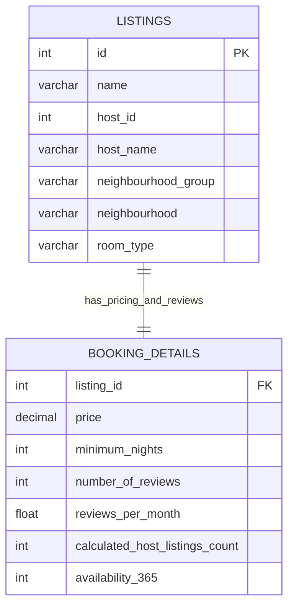

# 🏠 Airbnb NYC Lodging & Booking Market Analysis

[](https://www.mysql.com/)
[](https://en.wikipedia.org/wiki/SQL)
[](https://github.com/jadavharsh109/airbnb-nyc-market-analysis-sql)
[](https://www.linkedin.com/in/harshjadav0901/)
[](LICENSE)

An in-depth **SQL real estate market analysis** examining nearly 49,000 Airbnb property listings across New York City’s five boroughs (Manhattan, Brooklyn, Queens, the Bronx, and Staten Island).

The goal of this project is to analyze property rental prices, room types, minimum stay rules, and host portfolios to understand how the short-term rental market operates in NYC.

---

## 📑 Table of Contents
- [📌 Project Overview](#-project-overview)
- [📁 Project Files](#-project-files)
- [🗄️ Database Architecture (ER Diagram)](#️-database-architecture-er-diagram)
- [📋 The 2 Datasets Explained](#-the-2-datasets-explained)
- [📊 Key Market & Pricing Insights](#-key-market--pricing-insights)
- [🛠️ SQL Skills Used](#️-sql-skills-used)
- [🚀 How to Run This Project](#-how-to-run-this-project)
- [👨‍💻 Author](#-author)

---

## 📌 Project Overview

New York City has one of the largest short-term rental markets in the world. Looking at Airbnb data helps answer practical questions:
* Which boroughs are the most expensive, and which offer the best value for money?
* How much more can a host charge for an entire apartment compared to a private room?
* How many hosts are regular homeowners renting one room vs. commercial operators managing dozens of apartments?
* What kinds of listings get the most reviews and bookings?

This project organizes ~49,000 real-world records into relational tables in MySQL and uses 50 business queries to uncover key lodging trends.

---

## 📁 Project Files

```
airbnb-nyc-market-analysis-sql/
├── data/
│   ├── listing.csv                      # 48,895 listings with host names, locations, and room types
│   └── Booking_details.csv              # 48,895 booking records with prices, minimum stays, and reviews
├── sql/
│   ├── 01_schema_setup.sql              # Creates tables, primary/foreign keys, and indexes
│   ├── 02_exploratory_and_pricing_analytics.sql # 18 queries exploring prices, nights, and boroughs
│   └── 03_advanced_business_analytics.sql # 13 advanced queries with self-joins and subqueries
├── .gitignore                           # Git settings
├── LICENSE                              # MIT License
└── README.md                            # Project documentation
```

---

## 🗄️ Database Architecture (ER Diagram)

The two tables are linked by the listing ID:



---

## 📋 The 2 Datasets Explained

1. **`Listings`**: Contains property ID, headline title, host ID, host name, borough (`neighbourhood_group`), specific neighborhood, and room category (`Entire home/apt`, `Private room`, `Shared room`).
2. **`Booking_Details`**: Contains nightly rental price in USD, minimum required stay in nights, total customer reviews, review pace per month, total properties owned by the host, and days available per year (0 to 365).

---

## 📊 Key Market & Pricing Insights

Here are the main discoveries from running the SQL queries:

### 1. Where Most Listings Are Located
* **Manhattan and Brooklyn hold over 85% of all NYC listings**, making them the primary centers of the short-term rental market.
* **Manhattan is the most expensive borough**, averaging **$196.88 per night**.
* **Brooklyn comes in second**, averaging **$124.38 per night**.
* **The Bronx is the most affordable borough**, averaging around **$87.50 per night**, offering budget-friendly lodging options for travelers.

### 2. Entire Homes vs. Private Rooms
* Renting an **Entire Home or Apartment costs more than double** the price of a Private Room:
  * **Entire Home/Apt:** Averages **$211.79 per night**.
  * **Private Room:** Averages **$89.78 per night**.
  * **Shared Room:** The cheapest option, averaging **$70.13 per night** (less than 3% of all listings).
* *Takeaway:* Renting out an entire unit provides the highest earning potential for hosts.

### 3. Identifying Multi-Property Commercial Hosts (Self-Joins)
* Using SQL **self-joins**, the queries identified individual host accounts managing multiple separate properties across different neighborhoods.
* The top commercial hosts managed dozens of properties each, showing that a significant portion of NYC's short-term rental supply is run by professional property management companies rather than individual homeowners.

### 4. High-Demand Properties (500+ Reviews)
* The queries isolated top-performing listings with **over 500 customer reviews** and an active monthly review rate of **more than 5 reviews per month**.
* These listings are consistently booked year-round, located primarily within walking distance of central subway lines and major tourist hubs.

### 5. Minimum Stay Rules by Neighborhood
* In several residential neighborhoods, the average minimum stay was **greater than 5 to 10 nights**.
* This reflects local city housing regulations and host preferences designed to attract long-term visitors rather than weekend party crowds.

### 6. Listing Title Keyword Insights ('Cozy' Marketing)
* Over 4,600 listings used the word `'cozy'` in their title headline.
* "Cozy" listings had an average nightly rate of **$110**, showing this keyword is widely used to market smaller, budget-friendly studio apartments.

### 7. Property Availability Throughout the Year
* About 25% of properties had very low availability (< 30 days a year), indicating they are either lived in by the owner most of the year or booked out far in advance.
* Conversely, dedicated commercial rentals showed high availability (> 300 days a year), operating essentially as full-time boutique hotel rooms.

---

## 🛠️ SQL Skills Used

* **Self-Joins:** Connecting a table to itself (`Listings a JOIN Listings b ON a.host_id = b.host_id AND a.id < b.id`) to pair distinct properties owned by the same host without duplicates.
* **Subqueries:** Filtering high-value listings and top hosts dynamically using nested `WHERE id IN (...)` queries.
* **Aggregations & Filtering:** Summarizing average prices, review counts, and minimum stay requirements using `GROUP BY` and `HAVING`.
* **Pattern Matching:** Searching listing headlines using text filters (`LIKE '%cozy%'`).
* **Relational Joins:** Combining listing descriptions with booking metrics across ~49,000 records.

---

## 🚀 How to Run This Project

### What You Need
* MySQL Server or MySQL Workbench installed on your computer.

### Step-by-Step Instructions
1. **Clone this repository:**
   ```bash
   git clone https://github.com/jadavharsh109/airbnb-nyc-market-analysis-sql.git
   cd airbnb-nyc-market-analysis-sql
   ```
2. **Create tables and import datasets:**
   * Run [`sql/01_schema_setup.sql`](sql/01_schema_setup.sql) in MySQL Workbench.
   * Import [`data/listing.csv`](data/listing.csv) and [`data/Booking_details.csv`](data/Booking_details.csv) using the Table Data Import Wizard.
3. **Run pricing and borough analytics:**
   * Run [`sql/02_exploratory_and_pricing_analytics.sql`](sql/02_exploratory_and_pricing_analytics.sql).
4. **Run advanced market & host portfolio queries:**
   * Run [`sql/03_advanced_business_analytics.sql`](sql/03_advanced_business_analytics.sql) to see self-joins, subqueries, and host portfolio analytics.

---

## 👨‍💻 Author

**Harsh Jadav**
* 💼 **LinkedIn:** [linkedin.com/in/harshjadav0901](https://www.linkedin.com/in/harshjadav0901/)
* 🐙 **GitHub:** [github.com/jadavharsh109](https://github.com/jadavharsh109)
* 📧 **Email:** [jadavharsh109@gmail.com](mailto:jadavharsh109@gmail.com)

*If you found this NYC real estate SQL analysis interesting or useful, please give it a ⭐!*
